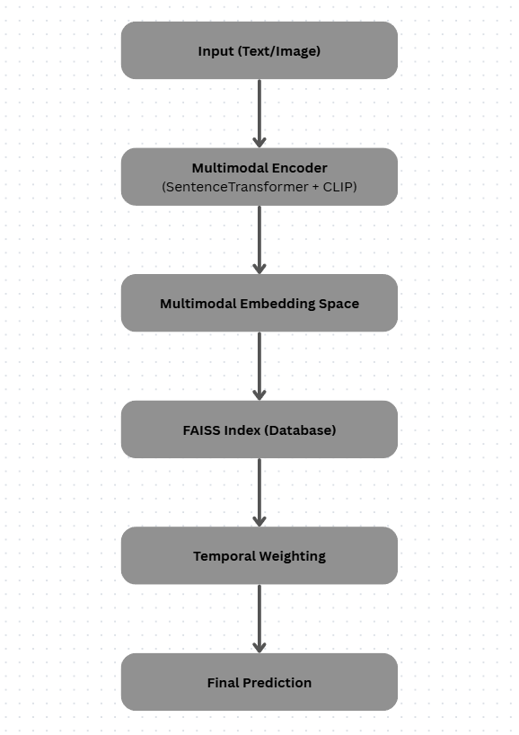

# TempCast  
### Retrieval-Based Multimodal Framework for Temporal Event Prediction Using Embedding Similarity and Temporal Weighting

## Research Overview

**TempCast: A Retrieval-Based Multimodal Framework for Temporal Event Prediction Using Embedding Similarity and Temporal Weighting**

Meet Arora, Soumyadipta Ghosh, Yash Sharma  
School of Computer Science and Technology, Bennett University, India  

Version: 1.0 | Year: 2026  
Type: Research Prototype (IEEE-Style Implementation)

---

## Project Badges

<p align="center">


</p>

---

## Abstract

Temporal event prediction in real-world environments remains challenging due to multimodal data heterogenity, temporal irregularities, and noisy observations. Existing statistical and deep learning approaches often fail because they don’t generalize effectively across dynamic event distributions while maintaining real-time performance as there always remains discrepancy to some extent.
This paper aims to present our solution called TempCast which is a retrieval-based multimodal framework for temporal event prediction. Our proposed system leverages SentenceTransformer and CLIP models for semantic representation, FAISS for efficient similarity search, and temporal decay-based weighting to incorporate temporal dynamics as we think this could fix the issues the previous conventional methods were facing.
Unlike conventional sequence models such as LSTM and Transformers, TempCast does it differently as it reformulates predictions as a retrieval problem in embedding space, improving scalability, interpretability, and inference efficiency. Experimental evaluation on a curated multimodal dataset demonstrates improved accuracy and reduced latency compared to baseline approaches and previous solutions.

---

## System Overview

Traditional forecasting methods rely on sequence models like LSTMs and Transformers. However, they struggle with multimodal inputs, interpretability, and computational cost.

TempCast addresses this by:

- Encoding events into a shared embedding space
- Retrieving similar historical events using FAISS
- Applying temporal decay to prioritize recent events
- Generating predictions from nearest semantic neighbors

---

## System Architecture

<p align="center">
  
</p>

---

## Project Structure

```
TempCast/
│
├── app.py
├── cloud.py
├── requirements.txt
├── README.md
│
├── data/
│   ├── events.json
│   └── Images/
│       ├── 1.jpg
│       ├── ...
│
├── docs/
│   ├── architecture.png
│   └── TempCast__Copy_.pdf
│
├── models/
│   ├── forecasting_model.py
│   ├── image_model.py
│   ├── temporal_memory.py
│   └── __init__.py
│
├── services/
│   ├── forecast_service.py
│   ├── image_service.py
│   ├── retrieval_service.py
│   └── __init__.py
│
└── utils/
    ├── data_loader.py
    └── __init__.py
```

---

## Dataset Design

TempCast uses a **curated multimodal dataset (15 samples)**.

Each sample contains:
- Event Description (text)
- Image (visual context)
- Image Hint (semantic augmentation)
- Event Type (label)
- Timestamp (temporal ordering)
- Expected Next Event (ground truth)

This dataset is a **proof-of-concept research dataset**, not a large-scale training corpus.

---

## Methodology

### Multimodal Embedding

```
E = αE_text + (1 - α)E_image
```

### Retrieval Objective

```
y = argmax(sim(f(x), f(y_i)))
```

### Cosine Similarity

```
sim(a, b) = (a · b) / (||a|| ||b||)
```

### Temporal Decay

```
S_i = sim(E_q, E_i) · e^(-λ (t - t_i))
```

---

## API Deployment (FastAPI)

### Run Locally

```bash
pip install -r requirements.txt
uvicorn cloud:app --reload
```

---

### API Endpoints

```
GET  /        → Health Check
POST /predict → Event Prediction
```

---

### Example API Code

```python
from fastapi import FastAPI
from services.forecast_service import run_forecast

app = FastAPI()

@app.get("/")
def home():
    return {"message": "TempCast running"}

@app.post("/predict")
def predict(text: str):
    result = run_forecast(text)
    return {"prediction": result}
```

---

## Dependencies

Install using:

```bash
pip install -r requirements.txt
```

### Requirements:
```
fastapi
uvicorn
pillow
numpy
faiss-cpu
transformers
sentence-transformers
```

---

## Results

| Model        | Accuracy | Precision | Recall | Latency |
|--------------|----------|-----------|--------|---------|
| LSTM         | 72%      | 70%       | 71%    | 60 ms   |
| Transformer  | 78%      | 76%       | 77%    | 100 ms  |
| TempCast     | 86%      | 85%       | 84%    | 30 ms   |

---

## Key Contributions

- Retrieval-based formulation of temporal prediction
- Multimodal embedding fusion (text + image)
- Temporal decay weighting mechanism
- FAISS-based scalable similarity search
- Low-latency inference system (~30ms)

---

## Limitations

- Small dataset size (15 samples only)
- Limited generalization to unseen events
- Sensitive to α and λ hyperparameters
- Requires dataset scaling for real-world deployment

---

## Future Work

- Expansion of dataset with real-world event streams
- Development of GUI for interactive prediction visualization

---

## Repository

https://github.com/meetarora19/TempCast